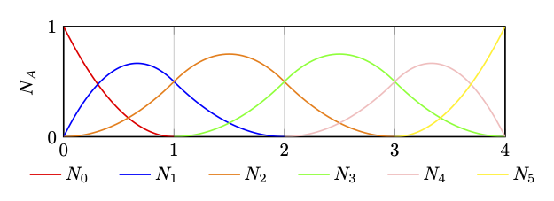
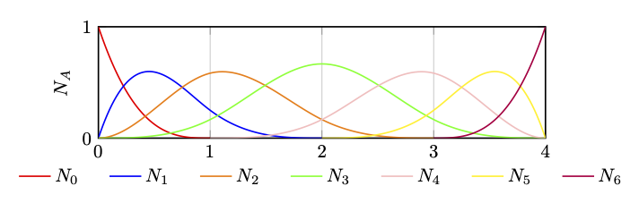

# Bspline Basis Function Visualization
A project to visualize B-Spline basis functions to check their validity.

## Setting
- Basis Function Order: configure in `run.sh`
- Knots Vector: define in `gen_knots.py`
- X-Axis Label: set in `pgfplots/pgfplots.tex`
- Plot Files: Adjust in `pgfplots/pgfplots.tex`

## Notes
- [ ] `make_splines.py` is currently not published.

## Run
```
./src/run.sh
```

## Examples
**Example 1: B-Spline Basis Function (Second Order)**

knots vector: [0,0,0,1,2,3,4,4,4]

<p align="center">
  
</p>

**Example 2: B-Spline Basis Function (Third Order)**

knots vector: [0,0,0,0,1,2,3,4,4,4,4]

<p align="center">
  
</p>

